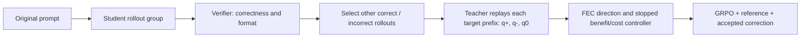

# VERPO

[English](README.md) | [简体中文](README.zh-CN.md)

**Verified Evidence Regularized Policy Optimization**

[Paper (arXiv v2)](https://arxiv.org/abs/2609.06100v2) · [Reproduction guide](docs/reproduce_paper.md) · [Data](docs/data.md) · [Results and provenance](results/README.md)

VERPO retains the GRPO outcome objective and uses a stopped token controller to
accept evidence-induced corrections. Fixed, CTR and FEC select different
correction directions; LW weights the evidence loss and AM modulates advantages.



## Implementation and verification status

The native veRL launcher is the training interface. This revision uses **same-group
rollout evidence**, excluding the target itself. It never falls back to a dataset
solution or ground-truth text. Ground truth is available only to the verifier.
The selected response is evidence text; `q+` is the Teacher distribution obtained
by replaying the *target's* prefix with that evidence. Reference and `q0` use
no evidence; with an EMA Teacher this implementation uses its moving shadow for
both branches, while keeping the reference loss independent of evidence gating.

The `pipeline/trl/` entry is a **synthetic loss smoke**, not a pretrained-model TRL
training backend. It uses artificial tokens and a tiny model. Torch is optional
for lightweight contract checks and is not installed by the default CI.

CPU checks do not establish GPU training success or reproduction of paper scores.
See [verification](docs/verification.md) for executed checks and explicit gaps.

## Quickstart

Linux and Bash are required for native GPU training. Install
[uv](https://docs.astral.sh/uv/), then create the lightweight environment:

```bash
uv venv --python 3.12
uv pip install -r requirements-check.txt
uv run --no-sync python -m pytest tests -q
```

Inspect a paper configuration without downloads, credentials or GPUs:

```bash
bash pipeline/verl_math/run.sh \
  --model qwen3_4b --finetuning full --hardware a800_8x_80gb \
  --matrix paper_main --print-command
```

`--print-config` only composes YAML. `--print-command` runs the real engine's
preflight and prints its actual Hydra projection. For a single LW cell:

```bash
bash pipeline/verl_math/run.sh \
  --model qwen3_4b --finetuning full --hardware a800_8x_80gb \
  --protocol sdpo_section3_biology --teacher ema_095 --arm fec_fkl \
  --set protocol.total_training_steps=200 --set method.lambda_evi=1.0 \
  --print-command
```

For formal training, provision a compatible GPU host and `SWANLAB_API_KEY` in its
environment, review the dry-run, then remove `--print-command`. The launcher
bootstraps the GPU runtime and prepares the pinned public data/model if missing.
Llama access may require Hugging Face model access authorization. No credentials
belong in commands, config files or logs.

## Paper configurations

| Matrix / arm | Meaning |
|---|---|
| `paper_main` | Five tasks × LW/AM; run once for each of the three backbones |
| `paper_combined` | Five tasks × LW+AM |
| `paper_ablations` | Fixed/CTR/FEC FKL and FEC RKL directions |
| `paper_baselines` | Public GRPO/SDPO/SRPO implementations |
| `fec_fkl` | VERPO-LW; paper matrix sets evidence coefficient to 1.0 |
| `fec_advmod_fkl` | VERPO-AM; evidence coefficient 0, advantage coefficient 1 |
| `fec_advmod_fkl_combined` | Both paths enabled |

The paper matrices use **200 trainer steps**, validation every 5, checkpoints
every 50 without pruning, and EMA decay 0.95. This is not 200 optimizer updates.
The historical general-purpose profiles retain their 300-step budget and their
own coefficients. RLSD/RLCSD paper numbers are transcribed in the results archive;
they do not imply runnable baseline matrices in this public release.

## Reported results

The following values are **paper v2 Table 2 transcriptions**, not measurements of
this checkout. The paper selects the highest evaluation score per task using the
test split during training. Average is the unweighted average of those separate
maxima, not a common/final checkpoint. Collapsed runs and reward hacking are
retained in the [complete transcription](results/paper_v2_table2.json).

| Backbone | VERPO-LW (%) | VERPO-AM (%) |
|---|---|---|
| Qwen3-4B | 68.57 | 66.71 |
| Qwen3-8B | 71.44 | 70.58 |
| Llama-3.2-1B | 56.57 | 55.19 |

Run IDs, selected steps, raw predictions and source-precision metrics have not
been matched to these historical entries. They are explicitly null in the
transcription. New rollout-only runs have a separate evidence-source identity.

## Repository map

- `risk_aware_opsd/`: losses, semantic configuration, data contract and evidence selection.
- `verl/`: vendored native training implementation and tensor tests.
- `pipeline/verl_math/`: native launcher; engine scripts are internal.
- `pipeline/trl/`: synthetic smoke only.
- `configs/`: pinned data manifest and composed training configurations.
- `tests/`: lightweight public-contract tests; optional tensor tests skip without torch.
- `results/`: source-labeled paper transcription and result-input example.

## Citation and license

```bibtex
@article{li2026verpo,
  title={VERPO: Verified Evidence Regularized Policy Optimization},
  author={Li, Haijiang and Lv, Chengyu and Zhang, Yi and Qian, Rui and Zhang, Zhibing and Shen, Xiangqing and Yang, Junjie and Zhang, Yuchen and Jiang, Wenyuan and Hu, Hanqing and Zhou, Cangqi},
  journal={arXiv preprint arXiv:2609.06100},
  year={2026},
  doi={10.48550/arXiv.2609.06100},
  url={https://arxiv.org/abs/2609.06100v2}
}
```

Project additions are licensed under [Apache-2.0](LICENSE). Vendored components
retain their original notices; see [third-party notices](THIRD_PARTY_NOTICES.md).
The native backend builds on [veRL](https://github.com/volcengine/verl).
