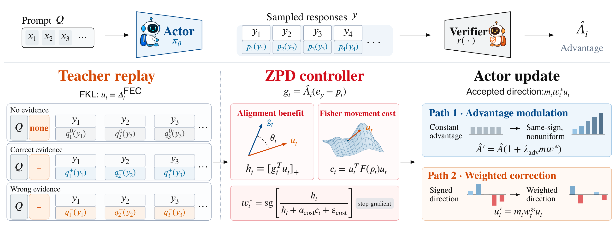
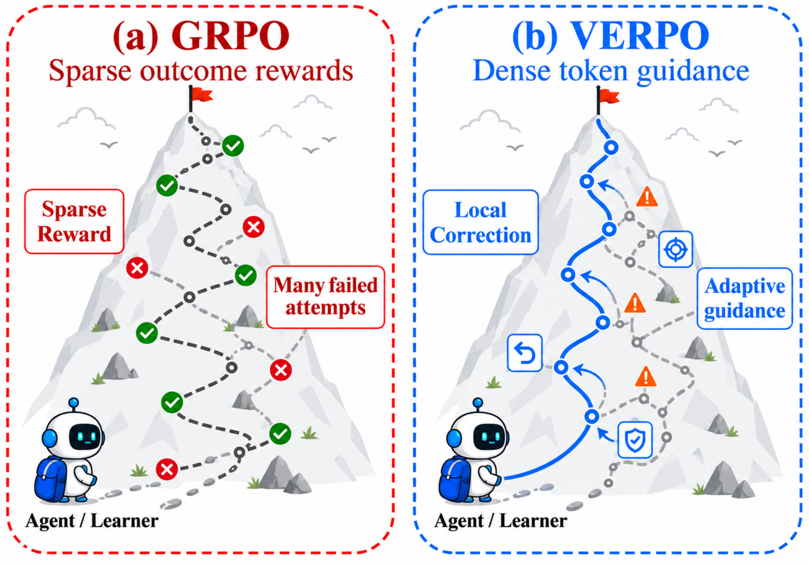

# VERPO: Verified Evidence Regularized Policy Optimization

[English](README.md) | [简体中文](README.zh-CN.md)

[](https://arxiv.org/abs/2609.06100) [](LICENSE)

[论文](https://arxiv.org/abs/2609.06100) · [PDF](https://arxiv.org/pdf/2609.06100) · [引用](#引用与许可) · [复现说明](docs/reproduce_paper.md) · [数据准备](docs/data.md)

本仓库提供 [VERPO 论文](https://arxiv.org/abs/2609.06100)的实现。

**作者：** Haijiang Li, Chengyu Lv, Yi Zhang, Rui Qian, Zhibing Zhang, Xiangqing Shen, Junjie Yang, Yuchen Zhang, Wenyuan Jiang, Hanqing Hu, Cangqi Zhou

**联系邮箱：** [hj523hj@163.com](mailto:hj523hj@163.com)

## Abstract

可验证奖励为语言模型提供了可靠的任务级反馈，但基于 Group Relative Policy Optimization（GRPO）的方法将序列级 advantage 均匀应用于所有 token。这种粗粒度的信用分配会奖励或惩罚整条回答，却无法区分哪些局部决策应该保留、强化或修改。另一方面，基于证据的自蒸馏能提供更密集的 token 级监督，但模仿 Teacher 也可能引入风格偏差和失准的置信度；当这些信号与任务成功不一致时，训练可能因此失稳。

我们提出 VERPO，在保留任务奖励目标的同时，将证据指导转化为与奖励方向一致的 token 级信用分配。VERPO 把 Teacher 指导拆分为无证据参考项，以及每个 token 上带符号的证据修正。一个停止梯度的控制器根据局部 GRPO 更新方向的一致性和 Fisher 移动代价，结合选择性接受、逐 token 定位与代价感知缩放。我们进一步提出 Fisher Evidence Contrast（FEC），通过正则化投影，减弱估计的证据存在方向上的干扰偏移。

在五项科学推理与工具调用任务上，论文报告 VERPO 避免了优化崩溃，并在各个模型骨干上取得最高的多任务平均分，尤其在较小模型上相对强基线有明显提升。定性诊断表明，token 接受会有选择地关注推理瓶颈，与局部奖励一致性及 Fisher 移动代价的设计相符。

*译自[论文 v2 摘要](https://arxiv.org/abs/2609.06100v2)；文中实验结论属于论文报告。*

## Overview

<p align="center">
  
</p>

**方法总览。** 论文图 3 展示四个阶段：采样 rollout 并获得奖励；通过 Teacher 回放构造 FEC 修正方向；由 ZPD 控制器计算 token 接受权重；最后执行 advantage 调制或加权证据修正。

<p align="center">
  
</p>

**直观对比。** 论文图 1 对比了 GRPO 的稀疏序列奖励与 VERPO 的证据驱动 token 指导。

图片直接渲染自[论文 v2](https://arxiv.org/pdf/2609.06100v2) 的矢量图；[来源与许可](assets/README.md)。

<details>
<summary>使用指南</summary>

- [最小入口](#最小入口)
- [论文配置](#论文配置)
- [引用与许可](#引用与许可)

</details>

## 最小入口

原生 GPU 训练使用 Linux 和 Bash。安装 uv 后：

```bash
uv venv --python 3.12
uv pip install -r requirements-check.txt
uv run --no-sync python -m pytest tests -q

bash pipeline/verl_math/run.sh \
  --model qwen3_4b --finetuning full --hardware a800_8x_80gb \
  --matrix paper_main --print-command
```

`--print-config` 只合成配置；`--print-command` 运行真实引擎参数检查并输出实际 Hydra 配置。
两者均不下载数据或模型，不检查凭据，不分配 GPU。

正式启动前，在服务器环境中配置 `SWANLAB_API_KEY`，审核 dry-run，然后移除 `--print-command`。
启动器会准备 GPU 运行环境、固定版本的数据和模型。Llama 模型可能需要 Hugging Face 访问授权。

## 论文配置

| 标识 | 用途 |
|---|---|
| `paper_main` | 五任务 × LW/AM，三个 backbone 分别运行 |
| `paper_combined` | LW+AM 联合路径 |
| `paper_ablations` | Fixed/CTR/FEC FKL 与 FEC RKL |
| `paper_baselines` | GRPO、SDPO、SRPO |
| `fec_fkl` | LW；论文矩阵指定 λ_evi=1.0 |
| `fec_advmod_fkl` | AM；λ_evi=0，advantage 系数为 1 |

论文矩阵固定 **200 个 trainer step**、每 5 步验证、每 50 步保存并保留全部 checkpoint、EMA 0.95。
200 trainer steps 与 200 optimizer updates 不等价；现有一般用途配置保留其 300-step 预算。
公开版本未提供 RLSD/RLCSD 主表结果对应的可运行矩阵，不能将论文转录视作实现验收。

## 引用与许可

如果在研究中使用 VERPO，请引用以下论文：

**[VERPO: Verified Evidence Regularized Policy Optimization](https://arxiv.org/abs/2609.06100)**，
Haijiang Li 等，arXiv:2609.06100（2026）。
以下 BibTeX 与 [CITATION.cff](CITATION.cff) 均使用 arXiv 的统一入口。

```bibtex
@article{li2026verpo,
  title={VERPO: Verified Evidence Regularized Policy Optimization},
  author={Li, Haijiang and Lv, Chengyu and Zhang, Yi and Qian, Rui and Zhang, Zhibing and Shen, Xiangqing and Yang, Junjie and Zhang, Yuchen and Jiang, Wenyuan and Hu, Hanqing and Zhou, Cangqi},
  journal={arXiv preprint arXiv:2609.06100},
  eprint={2609.06100},
  archivePrefix={arXiv},
  primaryClass={cs.LG},
  year={2026},
  doi={10.48550/arXiv.2609.06100},
  url={https://arxiv.org/abs/2609.06100}
}
```

主项目新增代码采用 [Apache-2.0](LICENSE)，第三方代码保留原版权和许可声明，见[第三方清单](THIRD_PARTY_NOTICES.md)。
